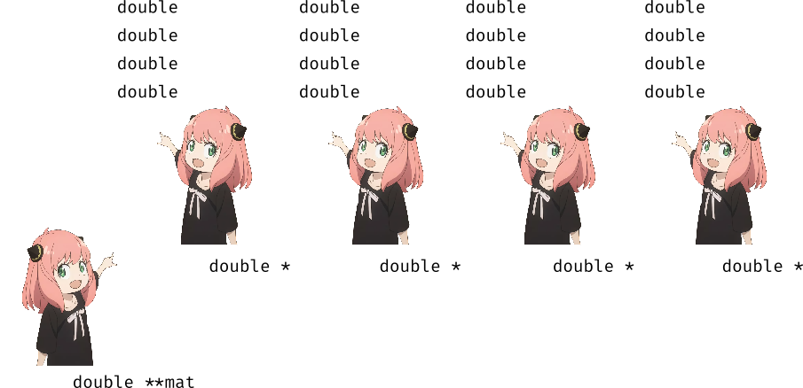

---
title: Representação Computacional
subtitle:  Algoritmos e Estruturas de Dados
author: Igor Montagner
...


Na primeira aula vimos as seguintes representações para grafos:


**Representação formal**:

Para grafos sem pesos:

- $V = \{1 \dots N\}$
- $E = \{ (x, y) | x, y \in V; x \neq y\}$ 

Para grafos com pesos:

- $V = \{1 \dots N\} $
- $E = \{ (x, y) | x, y \in V; x \neq y\}$ 
- $w(i, j) : E \rightarrow \mathcal{R}$ - função que recebe uma aresta e devolve seu peso. 

-----------------

**Representação computacional (grafos sem pesos)**:

- $V$ pode ser representado só pelos números mesmo. Só preciso guardar $|V| = N_v$
- $E$ pode ser representado como uma matriz $A$ quadrada com $N_v$ linhas e colunas

$$
A_{i,j} = \begin{cases}
1 \text{ se } (i,j) \in E \\
0 \text{ caso contrário }
\end{cases}
$$

**Representação computacional (grafos com pesos)**:

Se o grafo tiver pesos, então usamos a seguinte definição para a matriz $A$:

$$
A_{i,j} = \begin{cases}
w(i, j) \text{ se } (i,j) \in E \\
-\infty \text{ caso contrário }
\end{cases}
$$

[break]

## Arrays de arrays

O problema agora se torna representar essa matriz de maneira eficiente. Uma maneira comum de fazer isso é usando uma **array de arrays**. Ou seja, cada linha é um array (tipo `double *` em *C*). Agrupamos várias linhas em uma matriz criando um array em que cada elemento é outro array. Fazemos isso com o tipo `double **` em *C*. Veja a figura abaixo. 



Usar esta matriz é fácil!

```c
double **mat; // veio de algum lugar e já está alocada
mat[2][5] = 5; // acessa elemento na linha 2, coluna 5
```

## Alocação de Memória

Se cada linha da nossa matriz é um array, precisamos de dois níveis de alocação.

1. um para guardar o array com todas as $V$ linhas
2. $V$ alocações, uma para cada linha

Vamos pensar um pouco agora.

**Exercício**: Complete abaixo com a chamada para `malloc` que criaria o nível um acima para uma matriz de $4$ vértices

```c
double **mat =                           
```


A linha acima criou o primeiro nível, mas não criou **cada linha da matriz**. Na figura acima, ele criou as 4 *Anya* `double *`, mas não criou os 4 grupos de `double` que efetivamente guardam os dados. 

**Exercício**: Seguindo a ideia acima, complete o loop abaixo para criar as 4 linhas da matriz. 

```c
for (int i = 0; i < 4; i++) {

  
}
```

Pronto! Agora já conseguimos ir e usar nossa matriz! Note que:

1. não inicializamos nenhuma casa da matriz. 
2. precisamos liberar essa memória depois de acabar

Siga agora para o PrairieLearn para as atividades de Representação Computacional de grafos. 
